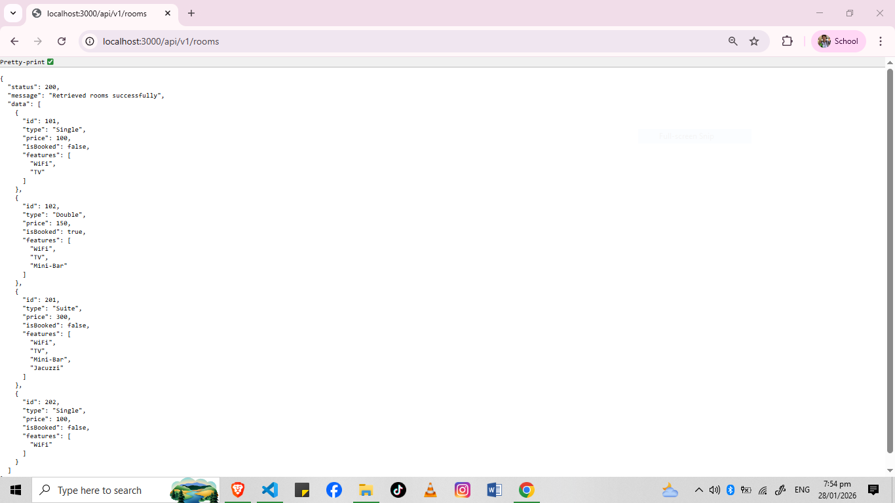

# RESTful API Activity - Justine S. Lachica

## Best Practices Implementation

### 1. Environment Variables
**Why did we put BASE_URI in .env instead of hardcoding it?**
**Answer:**
We put configuration details like `BASE_URI` in `.env` to separate configuration from the source code. This allows us to easily change settings (like ports or API versions) without modifying the actual code. It is also a security best practice to keep sensitive data and environment-specific settings out of the codebase.

### 2. Resource Modeling
**Why did we use plural nouns (e.g., /dishes) for our routes?**
**Answer:**
We use plural nouns because in RESTful architecture, an endpoint represents a **collection** of resources, not just a single file. For example, `/rooms` refers to the entire list of rooms. When we access `/rooms/1`, we are picking one specific item from that collection.

### 3. Status Codes
**When do we use 201 Created vs 200 OK?**
**Answer:**
* **201 Created:** Used specifically when a POST request successfully creates a new resource on the server.
* **200 OK:** Used for standard successful requests, such as retrieving data (GET) or updating an existing resource (PUT).

**Why is it important to return 404 instead of just an empty array or a generic error?**
**Answer:**
Returning a **404 Not Found** status code is specific and informative. It tells the client that the server is working, but the specific resource (like a Room ID) they requested does not exist. A generic error might confuse the user into thinking the server is broken, while an empty array (in some contexts like finding a specific ID) is misleading because it implies the search was valid but empty, rather than the resource itself being missing.

### 4. Testing

### Embed and Reference
**Why did I choose to Embed the [Review/Tag/Log]?**
**Answer**
I embed Log because they are strictly dependent on the parent document and are almost always retrieved together for context. This design maximizes read performance by fetching all necessary data in a single query, eliminating the latency of additional database lookups.

**Why did I choose to Reference the [Chef/User/Guest]?**
**Answer**
I reference Guest because they exist independently of any single transaction and require updates to reflect everywhere simultaneously. This prevents massive data duplication and ensures the parent document remains within size limits, regardless of how active the referenced user becomes.